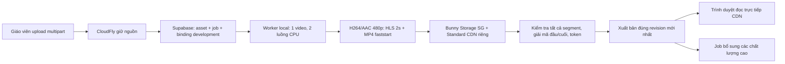

# Pipeline video: triển khai local và nghiệm thu

Ngày 1/10/2026. Đường phát production được giữ mặc định; pipeline mới cần bật rõ cả server và frontend. Đã viết code và kiểm thử database/FFmpeg; **chưa nghiệm thu tốc độ CDN hoặc production**.



## Những phần đã triển khai

| Task | Code và kiểm thử hiện có | Phần cần hạ tầng thật |
| --- | --- | --- |
| Kiểm kê | 17 video: 8 CloudFly + 9 Bunny. 9 nguồn truy cập được, 8 Bunny cần phục hồi/tải lại. Bao gồm video giới thiệu. | Tìm GUID đúng trong các thư viện khác khi có quyền Bunny account; chưa có số TTFF. |
| Tách môi trường | Hàng đợi, asset, binding, đường dẫn CDN tách development/production. Bật mặc định = tắt. Worker local từ chối production. | Bật development sau khi doctor đạt. |
| Queue bền vững | Nhận nguyên tử `SKIP LOCKED`, lease 5 phút, heartbeat 30 giây, 3 lần tự thử, ưu tiên base trước enhance. | Tắt/restart worker thật và kiểm tra đồng thời nhiều kết nối Postgres. |
| Upload | Kiểm tra quyền sở hữu khóa học; gắn target trước upload; hoàn tất và enqueue trong cùng RPC; HEAD dung lượng; gọi lại idempotent; đối soát mỗi phút. | Thử mất mạng và đóng tab qua CloudFly/Supabase thật. |
| Chuyển mã | 480p H264/AAC, không phóng lớn, đúng tỷ lệ/xoay; HLS fMP4/keyframe 2 giây; MP4 faststart; poster. Tạo base trực tiếp, không chờ HD. | Kiểm tra thêm nguồn mới trên máy và tài nguyên khi upload liên tục. |
| CDN | Script tạo storage SG/Standard và CDN Standard riêng; token theo thư mục asset; MIME, CORS, cache, timing headers. Worker HEAD mọi tệp, thử decode bytes đầu/cuối tải từ CDN, Range và token không hợp lệ/hết hạn. | Chưa tạo zone. Cần xác nhận phản hồi thực tế từ Bunny, cache giữa các token và phép đo CDN lạnh. |
| Thay thế | Giữ active khi pending upload/xử lý lỗi; RPC chỉ xuất bản pending mới nhất; worker cũ bị fence; gỡ video hủy job. Phiên xem giữ asset/manifest đã mở kể cả lúc làm mới token. | Thử thay A/B liên tiếp, gỡ khi đang chạy và xem lâu đến hết hạn token. |
| API/player | `getClaims` dùng JWKS cache ES256; DB kiểm tra quyền. API trả CDN trực tiếp; ưu tiên HLS/480p rồi Auto, MP4 dự phòng, hủy tải khi đổi bài. Không tải video giới thiệu khi chưa mở. | Kiểm tra autoplay, chất lượng, tiến độ/chống tua với tài khoản nhân viên thật. |
| Trạng thái giáo viên | Phân biệt upload/chờ/xử lý/xem được/bổ sung HD/lỗi; trạng thái từ server; retry; bản cũ vẫn phục vụ khi thay thế. | Kiểm tra reload trang lúc upload/xử lý và lỗi cuối ba lần thử. |
| Backfill/đo | Nhập theo target, không đổi app_documents/ID/quiz/progress; giữ nguồn Bunny tốt nhất kèm âm thanh riêng vào CloudFly. Trang đo 30 lượt và 10 video thực đồng thời, ghi cả timeout. | Chưa enqueue/chuyển dữ liệu thật hoặc chạy 30 lượt/video. |

Kiểm thử database dùng PostgreSQL trong PGlite và migration thật: idempotent upload, tách môi trường, thu hồi lease, chặn worker cũ, thứ tự xuất bản, HD lỗi giữ base, gỡ video và quyền truy cập. Đây chưa phải kiểm thử nhiều worker bằng các kết nối độc lập trên Supabase.

Kiểm thử FFmpeg: MP4 metadata cuối/đầu, MOV, WebM, HEVC thường/HDR, không âm thanh, video dọc, metadata xoay và pixel không vuông. HDR được tone-map sang SDR BT709. Đã sửa lỗi FFmpeg trên Windows ghi `init.mp4` ngoài thư mục rendition. HMAC/token và nhập chất lượng cao nhất có âm thanh riêng cũng được kiểm thử.

Sửa bài học và đính kèm tài liệu chỉ cập nhật các trường tương ứng, không lưu ngược toàn bộ bài học đã phủ binding development vào `app_documents`. Điều này giữ liên kết video production khi giáo viên chỉnh nội dung trên local.

## Cấu hình còn thiếu

- `SUPABASE_DB_URL` để chạy migration. Có thể áp dụng trực tiếp toàn bộ [migration](../supabase/migrations/20261001_0005_video_pipeline.sql) bằng SQL Editor trong **đúng** dự án hiện tại. Script kiểm tra URL có khớp project trước khi chạy.
- `BUNNY_ACCOUNT_API_KEY` để script tạo hai zone riêng, hoặc tự cấu hình và điền `BUNNY_VIDEO_STORAGE_ZONE`, `BUNNY_VIDEO_STORAGE_KEY`, `BUNNY_VIDEO_CDN_HOSTNAME`, `BUNNY_VIDEO_TOKEN_KEY`.
- Không đặt khóa video mới dưới `NEXT_PUBLIC_`. Các biến storage công khai cũ phục vụ ảnh/tài liệu không được dùng cho pipeline video.

Phiên Supabase đang mở trên Brave thấy dự án khác với project cấu hình trong ứng dụng và chưa truy cập được dự án `lijbojllmqwfmtinlhmy`. Bunny đã đăng nhập nhưng tại `/errors/account-suspended` báo tài khoản bị đình chỉ do hệ thống chống gian lận tự động đánh dấu. Cần quyền đúng dự án Supabase và tài khoản Bunny hoạt động để chạy bước hạ tầng. Chưa áp dụng migration hay thay cấu hình CDN qua các phiên đó. Chưa đủ bằng chứng để quy 8 nguồn Bunny trả 404 cho việc đình chỉ tài khoản.

## Chạy lần đầu trên máy bạn

1. Điền các cấu hình server còn thiếu vào `.env.local`, không gửi khóa qua chat.
2. Áp dụng migration:

   ```powershell
   npm run video:pipeline:migrate
   ```

3. Xem cấu hình Bunny dự kiến, sau đó tạo zone riêng:

   ```powershell
   npm run video:pipeline:bunny
   npm run video:pipeline:bunny -- --create
   ```

   Script lưu khóa vào `.env.local`; không tự bật pipeline. Không sửa CDN/Storage cũ. Storage Standard có vùng chính SG; CDN network `Type=0` là mạng Standard (API gọi là Premium).

4. Kiểm tra:

   ```powershell
   npm run video:pipeline:check
   ```

5. Sau khi đạt, thêm hai dòng và khởi động lại Next.js:

   ```dotenv
   VIDEO_PIPELINE_ENV=development
   NEXT_PUBLIC_VIDEO_PIPELINE_ENABLED=true
   ```

   Nếu chạy bằng `npm start`, cần chạy `npm run build` lại vì biến `NEXT_PUBLIC_` được đóng vào bundle lúc build.

6. Chạy kiểm kê và nhập các nguồn:

   ```powershell
   npm run video:pipeline:inventory
   npm run video:pipeline:backfill
   npm run video:pipeline:worker
   ```

   Backfill development từ chối production, không thay target đã gỡ hoặc đã có bản mới/pending. Nếu hoàn tất bị gián đoạn, chạy lại tự nối tiếp asset đang upload. Worker không cần Docker/VPS. `--once` xử lý tối đa một job; `--asset=<uuid>` chọn một asset. Chạy không có cờ để xử lý liên tục. Máy tắt thì job mới chờ, video đã xuất bản vẫn ở CDN.

## Báo cáo và phép đo

- `.local-backups/video-pipeline-inventory.json`: từng target/nguồn/trạng thái/phục hồi. TTFF chưa đo để `null`, không dùng thời gian HEAD làm thời gian phát.
- `.local-backups/video-pipeline-source-tests.json`: chuyển mã nguồn CloudFly thực trên máy. Thời gian trong báo cáo này là xử lý sau upload, **không phải thời gian mở video**.
- `.local-backups/video-pipeline-bunny-source-tests.json`: đã nhập thử nguồn Bunny còn truy cập được, giữ âm thanh và giải mã bản 480p đầu/cuối. 8/8 nguồn CloudFly thực cũng đã qua chuyển mã/giải mã local. Các bước này chưa upload bản CDN mới hoặc đổi database.
- `/video-diagnostics`: đăng nhập admin trên local đã bật development. Chạy 1 luồng, 10 luồng cùng video và 10 luồng khác video. Mỗi trường hợp có ít nhất 30 mẫu cho từng nguồn sẵn sàng; mỗi mẫu bắt đầu trước API cấp quyền và kết thúc qua `requestVideoFrameCallback`. Trình duyệt không hỗ trợ callback được ghi rõ là phép đo ước tính.
- Mỗi lượt đo có token hợp lệ khác nhau, nên trình duyệt không tái sử dụng URL media cũ. CDN vẫn cần xác nhận cache dùng chung giữa các token. Header `CDN-Cache` ghi cho segment đầu nếu trình duyệt đọc được.
- Muốn kiểm tra CDN lạnh: purge **zone development riêng** qua Bunny trước lượt thử và xác nhận segment đầu trả `MISS`; lượt sau xác nhận `HIT`. Không purge zone production cũ.
- Báo cáo JSON có API/manifest/segment/decode, lỗi/timeout và P95 từng video. Mẫu lỗi không bị loại khỏi P95. Mọi lượt phải <4000 ms; P95 10 luồng ≤1,2× P95 1 luồng. Video mất nguồn vẫn nằm trong danh sách và không đạt.
- Đây là 10 player thật trên cùng máy/tài khoản. Cần đo thêm 10 người/thiết bị với ≥10 Mbps mỗi người và RTT CDN ≤100 ms; phải ghi việc worker có đang xử lý video mới hay không. Cần thử khi worker đang chạy.

## Kiểm thử code

```powershell
npm run test:video-pipeline:database
npm run test:video-pipeline:media
npm run test:video-pipeline:signing
npm run video:pipeline:inventory
npm run test:video-pipeline:sources
npm run test:video-pipeline:bunny-source
npx tsc --noEmit --incremental false
npm run build
```

## Chuyển production sau

Người dùng đã yêu cầu thử bản code hiện tại trên production ngày 1/10/2026. Lần thử này giữ pipeline mới tắt, không chạy migration hoặc chuyển đường phát sang Bunny. Những thay đổi player gồm ngừng tải ngầm video giới thiệu và chỉ tải bài học khi mở player; kết quả vẫn cần đo trên production. Đây chưa phải nghiệm thu toàn bộ pipeline dưới 4 giây.

Mốc trước lần thử là `542fd7f1900b365bcfc3ffe6582c1c7b751cd1ce`, đã giữ trong nhánh local `codex/rollback-before-video-pipeline-20261001` và bundle `.local-backups/video-pre-pipeline-542fd7f.bundle`. Nếu cần quay lại sau khi người dùng test, ưu tiên rollback deployment trước đó trên Vercel hoặc revert đúng commit thử nghiệm rồi push. Không cần clone đè thư mục hoặc force-push làm mất lịch sử.

Để chuyển toàn bộ pipeline sau khi local đạt: đóng gói worker cho VPS, cấu hình production riêng, xác minh vùng function gần database, nhập theo khóa học và đo lại trên cả hai domain. Chỉ bật frontend production sau khi asset production đã xuất bản. Tắt cờ frontend/server để quay về đường phát cũ; nguồn gốc và app_documents giữ nguyên.

Chưa có lịch xóa các phiên bản CDN cũ/tệp upload CDN của attempt lỗi. Chúng được giữ để bảo toàn phiên đang xem; cần xác định retention và dọn theo tham chiếu/TTL token trước khi vận hành production lâu dài. Worker hiện dọn các tệp tạm trên máy.

Tài liệu chuẩn: [Bunny token theo thư mục](https://bunny.net/docs/cdn/security/token-authentication/advanced), [Bunny Core OpenAPI](https://bunny.net/docs/api-reference/core/openapi.json), [Supabase getClaims](https://supabase.com/docs/reference/javascript/auth-getclaims), [Vercel function region](https://vercel.com/docs/functions/configuring-functions/region).
